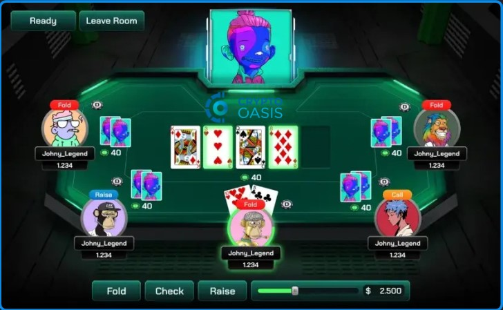
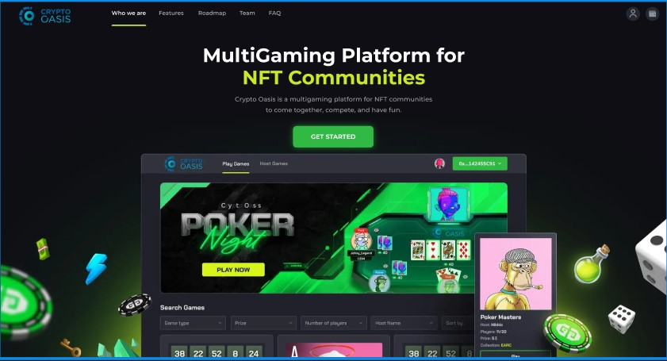

# CRYPTOOASIS_VER_2
## ✨ Project architecture


## ⚙️ Tech stack
- Frontend: React.js, SCSS
- Ethereum(Rinkeby Testnet), Ganache
- Etc: web3.js, NFT Storage, MetaMask
## 🧰 Get Started
To get this project up and running in your development environment, follow these step-by-step
instructions.
### 📋 Prerequisites
In order to install and run this project locally, you would need to have the following installed on
your local machine.
- [Node.js v20.16]
- [NPM v10.8.1]
- [Python v3.11]
- [Git]
### ⚙️ Installation and Run Locally
**Step 1:**
Download or clone this repo by using the link below:
```bash
git clone https://github.com/Laniorepsid/CryptoGame.git
```
**Step 2:**
Execute the following command in the root directory of the downloaded repo in order to install
dependencies:
### Install server dependencies

```bash
npm install --force
```

### Install client dependencies

```bash
cd client
npm install --force
```
**Step 3:**
Execute the following command in order to run the development server locally:
```bash
npm start
```
**Step 4:**
Open [http://localhost:3000](http://localhost:3000) with your browser to see the result.
### 📜 Scripts
All scripts are defined in the `package.json` file. Here is a list of all scripts:
| Script             | Action                                      |
| :----------------- | :------------------------------------------ |
| `npm install`      | Installs dependencies                       |
| `npm start`      | Starts local dev server at `localhost:3000` |
| `npm run build`    | Build your production site to `./dist/`     |
| `npm run preview`  | Boot up a local static web server           |
| `npm run lint`     | Run ESLint                                  |
| `npm run ts:check` | Perform type-checking                       |


